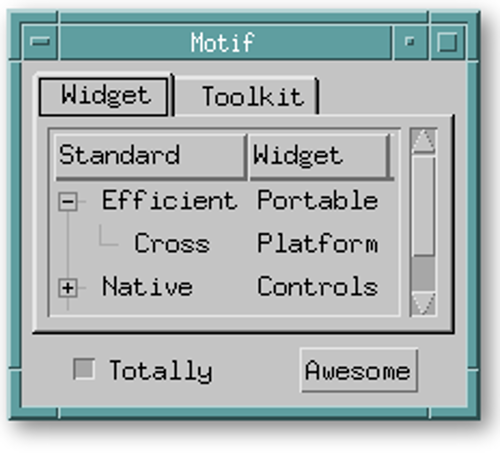

:title: Are we in the future, yet?
:data-transition-duration: 1500
:css: 2016-guadec.css

----

:id: title-slide

Are we in the future, yet?
==========================

A brief history of how GTK+ puts pretty things on your screen
-------------------------------------------------------------

GUADEC 2016 | Karlsruhe | Emmanuele Bassi <ebassi@gnome.org>
~~~~~~~~~~~~~~~~~~~~~~~~~~~~~~~~~~~~~~~~~~~~~~~~~~~~~~~~~~~~

----

Welcome!
========

----

This talk has **everything**
----------------------------

.. note::
   This talk will make you laugh, cry, think, and warm your heart.

   More importantly, though, this talk has two goals, one overt and one
   slightly covert. The former is to present you a history of the rendering
   in GTK+ over the years. The latter will become apparent at the end of the
   presentation.

----

Except ponies.

You will find no ponies, here

----

But you'll get a kitten
-----------------------

----

GTK+ has a long history
=======================

.. note::
   GTK+ is a toolkit with a long and varied history. Going through the commits
   log is like going through the strata of the ground — and like archeologists
   we can pretty much follow the evolution not only of how we think
   applications should look and behave, but also how toolkits should work in
   putting things on the user's screen.

----

Let's explore!
==============

.. note::
   So: sit back, relax, and let's crank up the time machine to go back to the
   glorious late '90s.

----

**1997**: GTK 0.x → 1.x

.. note::
   We are in 1997.
   
----

:data-x: r0
:data-y: r1000

.. note::
   The first MP3 was ripped just the previous year.

----

.. image:: images/win95.jpg

.. note::
   Windows 95 was replacing all Windows 3.1 installations.

----

.. image:: images/os2.png

.. note::
   IBM's OS/2 was dying.

----

.. image:: images/macos8.png

.. note::
   Apple was a small company still clinging to glories past.
   
----

.. image:: images/netscape3.gif

.. note::
   The browser wars were starting to get serious.
   
----

.. note::
   The apex of the X11 GUI toolkits was Motif.

----

.. image:: images/gtk-1-0.gif

.. note::
   And GTK (without the plus) looked like this.

----

It's windows all the way down
=============================

.. note::
   How was that gorgeous blob of gray pixels put on the screen? At that time,
   each GTK widget was backed by an X11 window for the output. Each window had
   various X11 parafernalia: a colormap, where colors would be allocated on
   the server; a visual, representing the number and depth of color channels
   available to the application; and a graphics context, which would provide
   a set of operations to be performed by the client on the server, like stipple
   patterns.

----

Drawing on the wire
===================

.. note::
   Yes, in the Glorious Old Days of Network Transparency, GTK was literally
   sending commands to the X server over the wire — just like every other
   X toolkit.

----

:data-x: r2000
:data-y: r-9000

**1999**: GTK 1.2

.. note::
   Let's jump in time a little bit, to the 1.2 days. It was the last days of
   the last millenium, and at that point GTK had grown support for themes…

----

:data-x: r0
:data-y: r1000

.. note::
   … Because nothing says "party like 1999" like green neon themes.

----

Still X11 all the way down
==========================

.. note::
   Underneath it all, though, GTK was still pushing commands to the X server over
   the wire. It's important to note that GTK was still not working on any other
   windowing systems outside of X11, a state of grace from which we would soon fall
   out of.

----

:data-x: r2000
:data-y: r-2000

**2002**: GTK+ 2.0

.. note::
   Past the crazy end of the millenium — or "Willennium", as it was then
   known; kids, ask your parents — GTK was all grown up. Not only it spun off
   the type system into its own library, thus getting a '+' in its name, GTK
   developers finally acknowledged that other people were living in sin, and
   decided to bring them to the light by adding support for their platform.

----

:id: sorry
:data-x: r0
:data-y: r1000

Abstracting means never saying you're
-------------------------------------
ExcuseSingletonInterfaceFactory().Sorry().Apologize()
-----------------------------------------------------

.. note::
   This meant separating the API from the implementation for things like
   drawing contexts, visuals, and other backend-specific constructs.

----

GDK is the continuation of X11 by other means
=============================================

.. note::
   Thus began the grand work of reimplementing the X11 API on other platforms.

----

.. image:: images/gimp-1-2.jpg

----

:data-x: r2000
:data-y: r-3000
:data-rotate-z: 90

The world doesn't stop turning just because you think Linux is about choice
===========================================================================

.. note::
   In the meantime, though, things were moving in different directions even
   in the X world. X developers, though a misunderstanding of how modern GPUs
   worked, created the RENDER extension to the core protocol, which added
   Porter-Duff compositing operators to pixel buffers, and a library called
   "Cairo" exploiting them was created. Instead of making the X server know
   how to render all the possible font types on this planet, or have
   applications send the whole font vector data over the wire thus requiring
   Gb/s connections to render "Hello world" in Comic Sans, toolkits started
   using client side buffers to shape text. Once the forbidden fruit of doing
   things in a sensible way had been tasted, the end of the Network Transparent
   Age came quickly.

----

:data-x: r1000
:data-y: r0

Cairo
=====

.. note::
   GTK+ 2.8 introduced the dependency on Cairo, and developers were asked to
   replace the GDK drawing calls, which would go through the X server, or
   through an emulation of what the X server would do, with Cairo drawing.
   For good measure, both APIs were supported but mixing them would lead to
   interesting results, so the old drawing API was deprecated, and waiting
   to be placed on the chopping block in the next major API bump.

----

Client-side windows
===================

.. note::
   In GTK+ 2.18 changed the way GTK would draw once again, by dropping
   native windowing system surfaces in favour of "client-side windows". GDK
   would maintain an internal hierarchy of drawable surfaces, and would
   only use native surfaces on request.

----

:data-rotate-z: -90
:data-x: r1000
:data-y: r0

**2011**: GTK+ 3.0 → …

.. note::
   GTK+ 3.0, the major API bump of 2011. The 2.x API was 9 years old, but
   the drawing API that GTK+ was stringing along was, at that point, almost
   14 years old.

----

:data-x: r2000
:data-y: r0

• OpenGL
• transparent windows

.. note::
   During the 3.x API cycle we introduced additional changes to enable
   drawing CSS primitives, as well as enabling drawing with OpenGL within
   the GTK+ drawing cycle. The churn has been huge, but it has moved the
   toolkit in a more modern direction.

----

:data-x: r-2000
:data-y: r-2000

Except…
=======

----

:data-x: r2000
:data-y: r0

GPUs are not going away
=======================

(no matter if you close your eyes and pretend they don't exist)
---------------------------------------------------------------

.. note::
   GPUs started taking off between 2002 and 2011, and these days toolkits
   are expected to use them. Cairo is well-equipped at taking advantage
   of GPUs with dedicated 2D pipelines like Intel, and Intel, and Intel;
   falling their presence, Cairo works very well on Intel-compatible CPUs.
   Sadly, modern GPUs do not have 2D pipelines, and most devices available
   to users do not use Intel CPUs. For all of these, Cairo is fairly
   ill-equipped at doing its job efficiently.

----

:data-x: r2000

CSS
===

.. note::
   Additionally, GTK+ has switched to a new, declarative API in order to
   describe how widgets should look like: CSS. CSS has its own state, just
   like Cairo, but the two do not necessarily get along. GTK+, like web
   browsers before it, requires to blast away most of the Cairo state in
   order to replace it with the one computed through the CSS style
   machinery.

----

OpenGL is actually getting better
=================================

(even if its design is still terrible)
--------------------------------------

.. note::
   Instead of Cairo, we could use a new drawing API, like OpenGL. Now that
   OpenGL implementations available on Linux have finally reached a
   competitive position. Except that OpenGL is pretty terrible at drawing
   GUI elements.

----

This is why we **can** have nice things
=======================================

.. note::
   We do have a way out: we can use GL for what it's good, and rely on
   Cairo for pretty rasterizations that create the gradients that Lapo
   seem to use pretty much everywhere in Adwaita.

----

Aim for the stars
=================

(Avoid hitting London, please)
------------------------------

.. note::
   The end goal is to have access to the power of graphics hardware while
   still getting good results for rendering complex things like fonts and
   paths.
   
   Additionally, we want to ensure that we use efficiently all the resources
   at our disposal, like multiple cores. Even a cheap mobile-like platform
   has at least two cores, these days.

----

Leave no app developer behind
=============================

.. note::
   At the same time, we want application developers to either not notice
   the change at all, or to slowly port away from the existing rendering
   code towards the new one.

----

We did this many times
======================

(with varied results)
---------------------

.. note::
   We achieve that in the same we achieved the migration from GDK/X11
   drawing primitives to Cairo: we add new API while we deprecate the old
   code paths; we allow mixing the two with a small performance penalty
   in the meantime, until we can break the API once again.

----

GSK
===

.. note::
   The new API is called GSK, and aside from providing a mid-level
   scene graph to replace Clutter and Clutter-GTK, it also provides a
   low-level retained rendering API for GTK to use.

----

Compositing and rendering CSS primitives
========================================

.. note::
   GSK uses OpenGL and OpenGL ES to ensure that resources are composited
   on the GPU instead of the CPU; it defers rendering to after we built
   the resources necessary to display the contents of the window, and this
   allows us to improve the toolkit even further.

----

:data-z: -3000

Are we in the future, yet?
==========================

.. note::
   So, the question is: are we in the future, yet?

----

:data-x: r800
:data-y: r0
:data-z: 0

We're close
===========

.. note::
   The answer is: we're on the threshold. The toolkit now enables us to
   do things that we'd never been able to do before.

----

:data-z: 3000
:data-x: r800

The future looks suspiciously like now
======================================

.. note::
   But the point of the future is that there's always something new on
   the horizon. What this talk should have convinced you is that the
   toolkit is not only alive, but it's also evolving. GTK+ is always
   getting better. The changes of the past 20 years are an indication of
   what we can achieve in the next 20.

----

:data-x: r2000
:data-y: r0
:data-z: 0

.. image:: images/welcome.jpg

----

:data-y: r0

Never give up, never surrender
==============================

.. note::
   Sure, it's been painful at times, and we must get better at both
   communicating change as well as providing "escape hatches" for application
   developers. The important thing, though, is that we cannot let the
   core toolkit of the GNOME platform, as well as *the* Linux toolkit,
   stagnate by simply staying still while the world around us moves on.

----

.. image:: images/endless.png

----

Thank you!
==========

----

 * License: CC by-sa 4.0
 * Source: https://github.com/ebassi/2016-guadec
 * Articles: https://www.bassi.io/tag/gsk-demystified/
 * Job: https://endlessm.com
